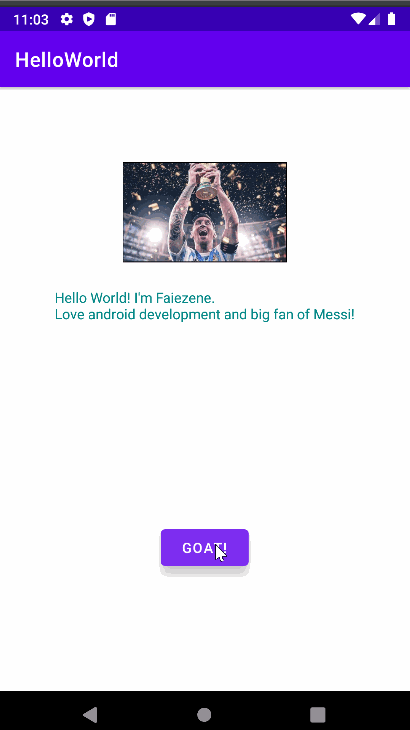

# Android Prework - *SimpleHelloWorld*

Submitted by: **Faiezene Zaman**

**SimpleHelloWorld** is an android app that shows an image and introductory message, and allows pressing a button to display a Toast. 

Time spent: **1** hours spent in total

## Required Features

The following **required** functionality is completed:

* [x] Image and introductory message displayed on screen
* [x] Button displayed on screen
* [x] Toast with message appears when button is pressed 

## Video Walkthrough

Here's a walkthrough of implemented features:

